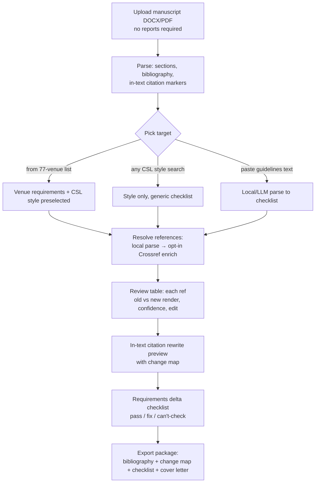
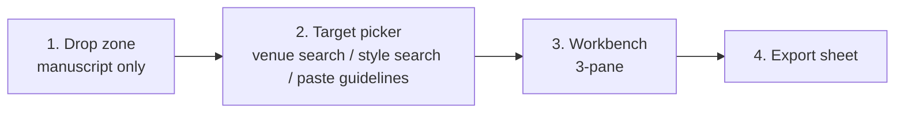

# Feature Plan: Resubmission Reformatter

*Research-backed plan for the next major feature of Revision Assistant. Plan only — no implementation.*
*Date: 2026-08-03*

---

## 1. Research summary — where researchers actually lose time

Pain points in the publish cycle, ranked by evidence-backed time cost **that a client-side tool can actually recover**:

| # | Pain point | Time cost (sourced) | Can we recover it? |
|---|-----------|--------------------|--------------------|
| 1 | **Formatting / reformatting manuscripts for (re)submission** | Median **14 h per manuscript**, **52 h/person/year** (~1 work-week), $477/manuscript in wage cost (PLOS ONE 2019, "Scientific sinkhole", n=372, 41 countries). Reformatting alone delays resubmission **>2 weeks in 51% of cases, >3 months in 20%** (PLOS ONE 2019, "High resource impact of reformatting"). Global burden **$1.1 B/yr** counting team time; a 2023 BMC Medicine study projects **$2.5 B lost 2022–2030** just on post-desk-rejection reformatting. Only **4% of journals** offer fully format-free submission; **91% of surveyed authors want the system reformed**. | **Yes — best target.** Deterministic, automatable, fully client-side. |
| 2 | Peer-review wait / reviewer scarcity | Reviewer acceptance fell 43%→22% (2018–2024); 4.5 invitations per secured review; time-to-acceptance up ~21% since 2018 (ScholarOne / Future of Peer Review 2026). Authors rank review wait as their #2 pain point. | **No.** Waiting time is not author-controllable; nothing to build. |
| 3 | Response-to-reviewers / rebuttal writing | Days per revision round (self-reports); "most time-sensitive part of the workflow" (SciSpace marketing). | **Partly, and we already do.** App has a response scaffold. Full round-trip parsing of decision letters is privacy-hostile (whole letters → cloud LLM) and the space is crowding fast (Peereply, SciSpace agent, Paper2Rebuttal, omnirebuttal). |
| 4 | Literature review / finding missing citations | Weeks, but spread across the project, not the submission crunch. | **Poorly.** Space is saturated with strong free/cheap tools (SciSpace, Elicit, Litmaps, Connected Papers, Semantic Scholar). OpenAlex now requires an API key with ~$1/day free quota — awkward for a keyless client-side app. Low differentiation. |
| 5 | Understanding author guidelines per journal | Hours per venue; guidelines are long, inconsistent, change silently. | **Yes, as a sub-feature** — via a curated requirements dataset + user-pasted-guidelines parsing (no scraping). |

**Key detail from the reformatting studies:** authors consistently name **references/citation style** as the single most onerous component ("particularly onerous [was] a review that required a [reformat] of references… publishers won't even agree to look at the article unless referencing styles are correct" — Chemistry World interview), followed by abstract structure, section order, and figure/table specs.

### Competitive gap

- **SciSpace (Typeset)**: 40 000 journal templates, but paid credits, cloud-only, **no MS Word integration** (converting back to Word "distorts equations and references"), template accuracy complaints for niche journals.
- **EndNote** ($275) / **Zotero** (free): restyle references in seconds — **but only if your library already contains every reference as structured data**. They cannot restyle a *finished manuscript* whose bibliography exists only as plain text in a DOCX/PDF. That is exactly the state a rejected manuscript is in.
- **Paperpal**: submission checks + citation generator, freemium but paywalled at volume; cloud-only.
- **Nobody** offers: *upload the rejected DOCX/PDF → get the reference list and in-text citations re-rendered in the new journal's style, plus a requirements delta checklist — without the manuscript leaving the browser.*

That last sentence is the feature.

---

## 2. Chosen feature — **Resubmission Reformatter**

> "Rejected? Reformat for your next journal in minutes, not days — your manuscript never leaves your browser."

### What it does

1. **Reference restyling** (core): parse the manuscript's plain-text bibliography → resolve each entry to structured metadata (local parsing first, optional Crossref lookup) → re-render the whole bibliography in the target style via CSL (`citation-js` + 10 000+ community CSL styles) → rewrite in-text citation markers to match (numeric `[12]` ↔ author-date `(Smith et al., 2020)` ↔ superscript, including renumbering when the target style orders by appearance vs. alphabetically).
2. **Requirements delta checklist**: compare the manuscript's measurable properties (abstract length & structure, word count, section order, title page items, figure/table counts, keywords, highlights, declarations) against the target venue's requirements; show a pass/fix list. Requirements come from (a) a curated per-venue dataset extending the existing 77-venue `venues.ts`, and (b) optionally, guidelines text the **user pastes** from the journal's site, parsed into a checklist locally/via the existing short-span LLM functions.
3. **Resubmission package export**: restyled bibliography + in-text citation change map (old marker → new marker, with locations) + delta checklist + refreshed cover letter (reusing the existing cover-letter function) as a copy-paste-friendly TXT/Markdown/DOCX-fragment bundle.

### Why this feature

- **Largest recoverable time sink** with the strongest published evidence (14 h/manuscript; references are the worst chunk).
- **Perfect strategic fit**: the moment of use (post-rejection, pre-resubmission) is exactly the moment users already open Revision Assistant, and it chains naturally into the existing Journal Readiness (pick next venue) → Submission Toolkit (checklist, cover letter) flow. Venue suggestion → reformat-for-that-venue closes the loop.
- **Privacy-first is a real differentiator here**: unpublished rejected manuscripts are precisely what researchers don't want uploaded to SaaS template mills.
- **Technically de-risked**: `citation-js` + `@citation-js/plugin-csl` are **already dependencies** (used by reference hygiene); DOCX/PDF parsing already exists; Crossref polite-pool usage already established for the retraction check.

### Time saved per manuscript (estimate)

- Reference restyling by hand for 40–80 refs: **3–8 h** → minutes + a review pass (~30 min).
- In-text renumbering (numeric→author-date or reorder): **1–2 h** → automatic with change map.
- Decoding new journal's guidelines into a to-do list: **1–2 h** → minutes.
- **Net: roughly 4–8 hours saved per resubmission**, out of the 14 h median formatting cost. (We do not claim page-layout/template reformatting — see scope cuts.)

### Legal / licensing review

| Asset | License / terms | Verdict |
|---|---|---|
| CSL style files (10 000+, official repo) | CC BY-SA 3.0 | ✅ Free to redistribute with attribution; ship selected styles, lazy-load the long tail. |
| `citation-js` | MPL-2.0 | ✅ Already a dependency. |
| `citeproc-js` (used inside plugin-csl) | CPAL-1.0 / AGPL-3.0 dual | ⚠️ Already shipped today via reference hygiene; CPAL requires attribution notice in the UI/docs — add it to `LegalNotices`. No new exposure, but document it. |
| Crossref REST API | Open, no auth; polite pool via `mailto`; 10 req/s single-record, 3 req/s queries (Dec 2025 limits) | ✅ Legal. Send only reference strings/DOIs (bibliographic facts, not manuscript prose) — and make the lookup **opt-in** per session, consistent with the retraction check. |
| Journal author guidelines pages | Publisher ToS generally prohibit scraping | 🚫 **Do not fetch/scrape publisher pages.** Curate our own requirements dataset (facts are not copyrightable; write descriptions in our own words) and/or let the **user paste** guidelines text they are licensed to view. Never store or redistribute pasted guideline text. |
| Journal names / style names | Nominative fair use | ✅ Keep the existing "not affiliated" disclaimers pattern. |

---

## 3. Feature spec

### User flow



### Pipeline components (all client-side unless noted)

1. **Bibliography segmenter** — extend existing reference extraction (`referenceHygiene` already consumes `ReferenceEntry[]`): split numbered/hanging-indent/author-year bibliographies into entries; handle DOCX (mammoth output) and PDF (existing extractor).
2. **Reference parser (local)** — heuristic + regex field extraction (authors, year, title, container, volume, pages, DOI, URL) into CSL-JSON. DOI-bearing entries are trivially resolvable; the rest get confidence scores.
3. **Crossref resolver (opt-in, network)** — `GET api.crossref.org/works?query.bibliographic=<string>&rows=2&mailto=…`; accept match only above a title-similarity threshold (reuse `fuzzyMatch`); throttle to ≤3 req/s, batch with progress UI; cache per session. Fallback: entry stays "local parse only", still restylable, flagged lower confidence.
4. **CSL renderer** — `citation-js` + target `.csl`. Ship top ~30 styles (APA 7, Vancouver, IEEE, AMA, ACS, Chicago, Harvard, Nature, Elsevier num/harv, Springer, MDPI, ACM…); fetch others from our own hosted copy of the styles repo (not from GitHub at runtime).
5. **In-text citation rewriter** — detect marker style in body text (already partially done: `detectedCitationStyle`); map each marker to bibliography entries; re-emit in target format with renumbering. Numeric↔author-date conversions produce a **change map** (old → new, character offsets) rather than silently rewriting prose; grouped citations `[3–5]` and `(Smith 2020; Lee 2021)` handled explicitly.
6. **Requirements delta engine** — pure functions comparing `ParsedPaper` stats against a `VenueRequirements` record: `{ abstractMaxWords, abstractStructured, wordLimit, sectionOrder, refStyle: cslId, titlePageItems[], figureLimits, keywordCount, declarations[] }`. Extends `checklist.ts` (`VENUE_STYLES`) from 5 generic styles to per-venue data.
7. **Guidelines digester (optional, LLM)** — user pastes guidelines text; a new Netlify function (same pattern as `explain`/`coverLetter`, Groq/Gemini) converts it to a `VenueRequirements` JSON. Manuscript text is never sent — only the pasted public guidelines. Local regex fallback for the common fields (word limits, abstract length, style name).
8. **Exporter** — extends `changeLog.ts` export: `bibliography.txt` (or `.docx` fragment via a light docx writer later), `citation_change_map.md`, `requirements_checklist.md`, cover letter.

### Privacy handling

- Manuscript body **never** leaves the browser (unchanged guarantee).
- Crossref lookups send only individual reference strings/DOIs, behind an explicit opt-in toggle with the same copy pattern as the retraction check; default = local parsing only.
- Pasted guidelines go to the existing Netlify LLM proxy only on explicit click; nothing stored.
- Existing 10-minute privacy wipe covers all Reformatter state.

### Edge cases

- **Unresolvable references** (theses, standards, URLs, non-English, preprints): keep local parse, render best-effort, badge "verify manually". Never drop an entry.
- **Duplicate/ambiguous Crossref matches**: show top-2 candidates, user picks; below threshold = no auto-accept.
- **Footnote citation styles** (Chicago notes): out of scope for MVP; detect and say so honestly.
- **LaTeX manuscripts**: out of scope (users have BibTeX); state it. Consider `.bib` export in v2 as a bridge.
- **Numeric reordering collisions**: change map is ordered and offsets recomputed; export as instructions rather than mutated PDF (layout preservation for body text with different-length markers is not reliable — be explicit).
- **Very long bibliographies** (300+): chunked progress, Crossref throttling means ~2 min — show ETA.
- **Grouped/range markers, ibid., et al. thresholds**: covered by CSL for bibliography; in-text grouping rules per style hard-coded for the shipped top styles, generic fallback otherwise.

### Phased milestones

**MVP (phase 1) — "References + checklist"**
- Standalone entry (manuscript only, no similarity/AI reports required).
- Bibliography segmentation + local parsing + opt-in Crossref enrichment.
- Restyle to top ~30 CSL styles; review table with confidence + inline edit.
- Delta checklist for the existing 77 curated venues (curated requirements for the top ~25 first, generic style-level fallback for the rest).
- Export: bibliography TXT + change map MD + checklist MD.
- Success metric: a 60-ref IEEE→APA conversion completes in <3 min with ≥90% of DOI-bearing refs rendered correctly.

**Phase 2**
- In-text citation rewriting with change map preview in `PaperView`.
- Paste-guidelines digester (LLM function + local fallback).
- Full CSL style search (10 000+ styles, lazy-loaded).
- Cover-letter refresh wired to the chosen target venue.

**Phase 3 (v2)**
- DOCX fragment export (drop-in bibliography with formatting).
- `.bib` / CSL-JSON / RIS export (bridge to LaTeX users and reference managers).
- Venue-to-venue "diff" ("what changes between IEEE Access and Sensors?").
- Community-maintained venue requirements data with "last verified" dates.

---

## 4. UI plan

### Where it lives

A **sibling mode, not a buried panel**. Reformatting happens on a different day than revision (post-rejection vs. pre-submission) and needs no similarity/AI reports, so it must not sit behind the analysis pipeline. Proposal: top-level mode switch in the header — **Revise** (current app) / **Reformat** (new) — with the Submission Toolkit remaining inside both where relevant. Single-page app stays; the switch is component-level state or a hash route (`#/reformat`), no router dependency required.

### Screens (Reformat mode)



**Screen 3, the workbench**, mirrors the existing split layout so it feels native:

```text
┌──────────────────────────────────────────────────────────────────────┐
│ Reformat: "Deep learning for X"   Target: Applied Energy (Elsevier)  │
│ [Style: APA 7 ▾]  [Enrich via Crossref: OFF ▸ opt-in]  [Export ▾]    │
├──────────────────────────────┬───────────────────────────────────────┤
│ REFERENCES (62)              │  REQUIREMENTS DELTA                   │
│ ✓ 41 resolved  ~ 15 parsed   │  ✓ Abstract ≤ 300 words (287)         │
│ ! 6 need review              │  ✗ Highlights: 3–5 bullets — missing  │
│ ┌──────────────────────────┐ │  ✓ Sections: IMRaD order OK           │
│ │ [12] old: IEEE render    │ │  ! Declaration of interest — not found│
│ │      new: APA render     │ │  ? Figure resolution — can't check    │
│ │      conf: high  [edit]  │ │                                       │
│ └──────────────────────────┘ │  IN-TEXT CHANGES (preview)            │
│ …                            │  "[3], [7]" → "(Kim, 2021; Wu, 2019)" │
└──────────────────────────────┴───────────────────────────────────────┘
```

### Copy tone

Same voice the app already uses: plain, honest, no over-claiming. Examples:
- Drop zone: *"Reformatting for a resubmission? Upload the manuscript — it stays in your browser."*
- Crossref toggle: *"Look up references on Crossref (sends only the reference text, never your manuscript). Improves accuracy for entries without DOIs."*
- Checklist caveat: *"Curated from public author guidelines; journals change requirements — always verify on the journal site (last verified: 2026-06)."*
- Unresolved badge: *"Parsed locally — check author names and page numbers yourself."*

### Landing page change

The current landing is a single upload flow plus a "What this session covers" list. Add a **two-door landing**: "Revise a manuscript" (existing) and "Reformat for resubmission" (new), each a card with a one-line value prop; the reformat card carries the stat *"Researchers report a median 14 hours formatting per manuscript."* The scope list gains one bullet for the Reformatter.

---

## 5. Website structure — current vs proposed

**Current** (single flow):

```text
Landing (upload paper + optional reports) → Revision workspace
  ├─ PaperView | FindingsQueue (grammar/similarity/AI/citation/quality filters)
  ├─ Journal readiness panel (+ venue suggestions, PDF)
  ├─ Submission toolkit (checklist, hygiene, statements, cover letter, reviewer response)
  └─ Export menu
```

**Proposed** (two modes, shared shell):

```text
Header: [RA] Revision Assistant        [ Revise ] [ Reformat ]        AuthBar
Landing: two door-cards + shared privacy banner + scope notes
  Revise    → unchanged current flow
  Reformat  → Target picker → Reformat workbench → Export
Cross-links:
  • Journal readiness venue suggestion → "Reformat for this venue" button
  • Reformat target picker ← reuses venues.ts search
  • Submission toolkit cover letter ↔ Reformat export sheet (same function)
Footer: LegalNotices + CSL / citeproc-js (CPAL) / Crossref attributions added
```

Justification: minimal structural change (one mode switch, one new workbench), maximal reuse (venues, checklist, hygiene parsing, LLM proxy pattern, privacy session, export plumbing), and it converts the app's story from "fix findings" to "get resubmitted", which matches the researched pain.

---

## 6. Honest risks

1. **Reference parsing accuracy is the make-or-break.** Local parsing of arbitrary plain-text references is genuinely hard (GROBID gets ~0.87 F1 with a server-side ML stack we can't ship). Mitigations: DOI-first strategy, Crossref `query.bibliographic` (>0.95 F1 resolution when a match exists), confidence badges, mandatory human review table. If accuracy on real bibliographies is below ~85% resolved-or-clean-parsed, the feature frustrates instead of saving time — build the evaluation set (50 real bibliographies across fields) *before* the UI.
2. **Crossref rate limits**: 3 req/s (polite pool, Dec 2025 rules) means a 300-ref paper takes ~2 min just for lookups; a burst of users behind one Netlify egress IP is fine (limits are per-`mailto`/user-side here since calls are browser-direct), but 429 handling and backoff are mandatory. No SLA — the feature must degrade gracefully to local-only.
3. **Venue requirements go stale.** Curated data needs "last verified" dates, a maintenance cadence, and defensive copy. Wrong checklist data that causes a desk rejection is worse than no checklist.
4. **In-text rewriting can corrupt meaning** (marker inside a quotation, "see refs. [3]-[5] for surveys"). Ship it as preview + change map + explicit apply, never silent, consistent with the app's existing no-silent-rewrite principle.
5. **citeproc-js CPAL attribution** must be added to `LegalNotices` (arguably already owed today via the citation-js dependency).
6. **Scope-creep temptation** toward full template/page-layout reformatting (SciSpace's turf, needs server-side rendering, breaks privacy story). The plan deliberately claims references + requirements only, and the copy must not promise "one-click journal formatting".
7. **Competitive response**: Paperpal/SciSpace could bundle the same flow; the durable moats are privacy (client-side), price (free), and the integrated rejection→re-target→reformat loop.

---

## Sources

- Clotworthy et al., *Scientific sinkhole: the pernicious price of formatting*, PLOS ONE 2019 — 14 h/manuscript, 52 h/yr, $477/manuscript.
- Jiang et al., *The high resource impact of reformatting requirements for scientific papers*, PLOS ONE 2019 — $1.1 B/yr, 4% format-free journals, 91% want reform, >2-week delays.
- *Saving time and money in biomedical publishing: the case for free-format submissions*, BMC Medicine 2023 — $230 M lost in 2021, $2.5 B projected 2022–2030.
- Chemistry World / Times Higher Education coverage & researcher interviews on formatting burden.
- Silverchair/ScholarOne *Future of Peer Review* 2025 & 2026 — reviewer decline rates, wait-time pain rankings.
- Crossref REST API docs & Dec 2025 rate-limit announcement; OpenAlex API key/pricing docs.
- CSL styles repo (CC BY-SA 3.0); citeproc-js docs (CPAL/AGPL); citation-js (MPL-2.0); AnyStyle/GROBID accuracy literature (arXiv:2205.14677).
- Tool landscape: SciSpace/Typeset pricing & reviews (no Word integration, template accuracy complaints), Paperpal, EndNote/Zotero restyling limits, Peereply/Paper2Rebuttal (rebuttal space), academia.stackexchange threads on resubmission practice.
